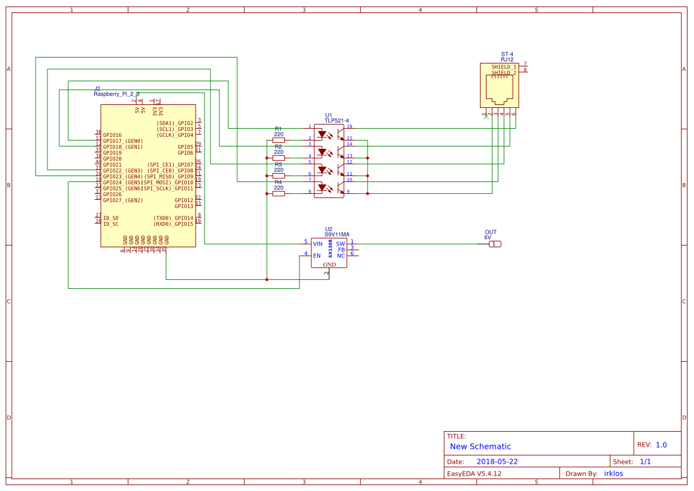

# telescope-scripts
Some scripts for Telescope Scripting Gateway Indi Mount Driver for st-4 on RaspberryPi   

Requirements:
- Raspberrypi 2/3
- indiserver with Telescope Scripting Gateway driver running
- ST-4 port (like this solution http://thx8411.over-blog.com/pages/Add_an_ST4_port_on_the_EQ4EQ5_motor_drives-3258969.html) 
- if you want to use a raspberryPi for source your power supply of your mount you need to Pololu S9V11MA for step up voltage from 5V to  6V
- TLP521-4 for gpio to st-4 converter (http://norikyu.blogspot.com/p/gpio-st-4.html)

GPIO Settings:
- RAP 17
- RAN 23
- DECP 22
- DECN 18
- POWER 24

Other Settings:
- self.speed=8 (or 4 )
- self.observing_location = Warsaw/Poland
- logfile = /tmp/mount.log

Using:
- copy scripts to /usr/share/indi/scripts/
- execute command '/usr/share/indi/scripts/mount.py start' (run python daemon that listen on localhost on port 5555)
- start indiserver with telescope scripting gateway driver (with indi web manager on port 8624) 
- run Kstars with Ekos 
- unpark mount 
- execute some goto scripts

Schematic:

ToDo:
- Park not working properly
- precised goto

Addons:
- Focuser (GPIO: IN1=10, IN2=9, IN3=25, IN4=27) based on 28BYJ-48 stepper motor and uln2003 driver 
- Web interface of mount driver based on virtualsky
